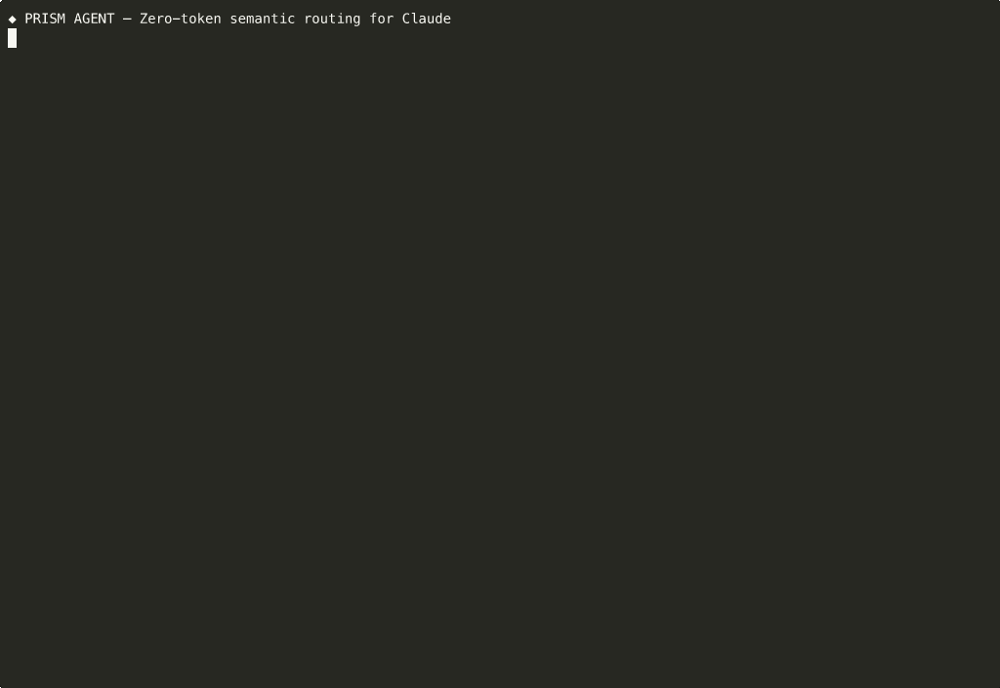

<div align="center">

```
  ██████╗ ██████╗ ██╗███████╗███╗   ███╗     █████╗  ██████╗ ███████╗███╗   ██╗████████╗
  ██╔══██╗██╔══██╗██║██╔════╝████╗ ████║    ██╔══██╗██╔════╝ ██╔════╝████╗  ██║╚══██╔══╝
  ██████╔╝██████╔╝██║███████╗██╔████╔██║    ███████║██║  ███╗█████╗  ██╔██╗ ██║   ██║   
  ██╔═══╝ ██╔══██╗██║╚════██║██║╚██╔╝██║    ██╔══██║██║   ██║██╔══╝  ██║╚██╗██║   ██║   
  ██║     ██║  ██║██║███████║██║ ╚═╝ ██║    ██║  ██║╚██████╔╝███████╗██║ ╚████║   ██║   
  ╚═╝     ╚═╝  ╚═╝╚═╝╚══════╝╚═╝     ╚═╝    ╚═╝  ╚═╝ ╚═════╝ ╚══════╝╚═╝  ╚═══╝   ╚═╝   
```



**The only AI coding agent that shows you exactly why it answered the way it did.**

[](https://www.npmjs.com/package/prism-agent)
[](https://github.com/PRAFULREDDYM/prism-agent/actions/workflows/publish.yml)
[](LICENSE)

</div>

Prism Agent is a standalone terminal AI coding agent that makes the routing layer visible. The left pane shows a live knowledge graph that updates in real time as you work, showing exactly which domains activated and why.

<div align="center">

> The live terminal UI — knowledge graph on the left, conversation on the right.

```text
┌─ PRISM AGENT ──────────────────────────────────────────────────┐
│ KNOWLEDGE GRAPH      │ CONVERSATION                            │
│                      │                                         │
│ ◆ security  ████ .91 │ you: fix the auth middleware            │
│ ◆ js        ███  .87 │                                         │
│   └── node  ██   .72 │ ● intent: DEBUG  domains: security,js  │
│                      │ ● tokens in: 312  saved: 148            │
│ [P]in [S]uppress     │                                         │
│                      │ agent: The issue is in line 34...       │
│ session stats:       │                                         │
│ tokens saved: 1,204  │                                         │
│ filler removed: 23   │ > _                                     │
└──────────────────────┴─────────────────────────────────────────┘
```

</div>

---

## What makes it different

Every other coding agent is a black box. You type a prompt, it thinks somewhere off-screen, and you get an answer with no visibility into why that answer happened.

Prism Agent makes the routing layer visible. You can see which domains activated, why they ranked highly, and how they relate to each other. You can also steer the agent directly by pinning domains you always want active or suppressing domains you do not want influencing the next turn. **Prism Agent is not just answering your request. It is showing its work.**

---

## Installation

```bash
npm install -g prism-agent
```

### Configuration
Set one of these environment variables before starting the full TUI:
- `ANTHROPIC_API_KEY`
- `PRISM_API_KEY`

You can keep the key in a local `.env` file or export it in your shell.

---

## Powered by [prism-ai](https://github.com/PRAFULREDDYM/prism-ai)

Prism Agent uses the [**prism-ai**](https://www.npmjs.com/package/prism-ai) core engine and layers on top:

- **Claude Code-style Tooling**: File system, shell, and git integration.
- **Interactive TUI**: Built with Ink for a high-fidelity terminal experience.
- **Graph Steering**: Real-time domain scoring with manual overrides.
- **Session Tracking**: Persistence, autosave, and detailed token stats.

---

## Commands

- `prism-agent`: Starts the full terminal UI.
- `prism-agent start --cwd /path/to/repo`: Opens Prism Agent against a specific repository.
- `prism-agent test "prompt"`: Runs a dry routing pass and prints detected intent and stats.
- `prism-agent history`: Lists recent saved sessions with token and turn stats.
- `prism-agent resume <id>`: Resumes a specific saved session.

---

## Keyboard shortcuts

- `Tab`: Switch focus between the conversation pane and the knowledge graph pane.
- `P`: Pin the currently focused domain in the graph pane.
- `S`: Suppress the currently focused domain in the graph pane.
- `C`: Clear all domain overrides in the graph pane.
- `Page Up` / `Page Down`: Scroll the conversation history.
- `Ctrl+S`: Toggle expanded session stats.
- `Ctrl+L`: Clear the terminal screen.
- `Ctrl+C`: Exit Prism Agent.

---

## Contributing

Contributions are welcome. For routing rules and filler patterns, please contribute directly to the [prism-ai](https://github.com/PRAFULREDDYM/prism-ai) repository. 

See [CONTRIBUTING.md](CONTRIBUTING.md) for local development setup.

---

## License

MIT — see [LICENSE](LICENSE).
